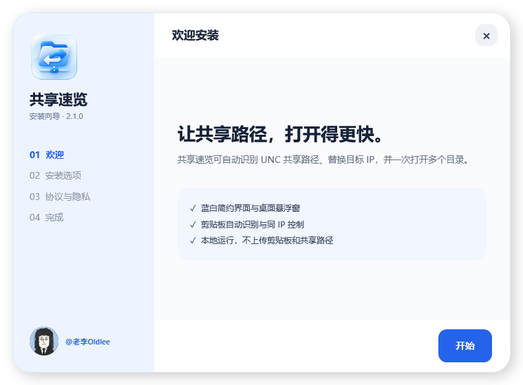
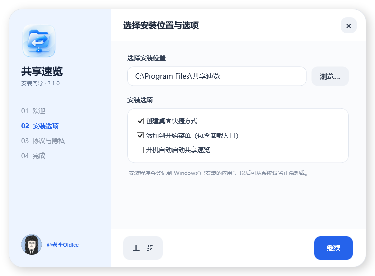
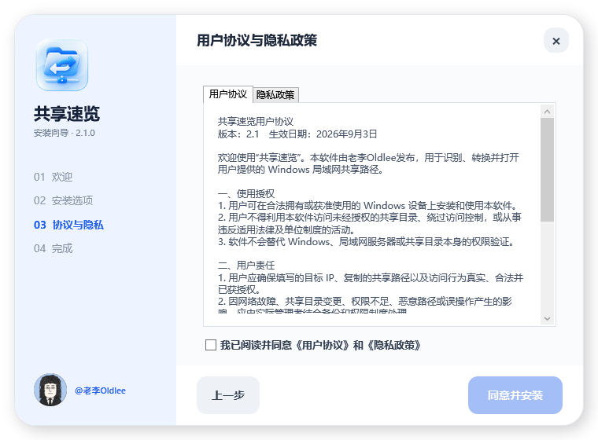
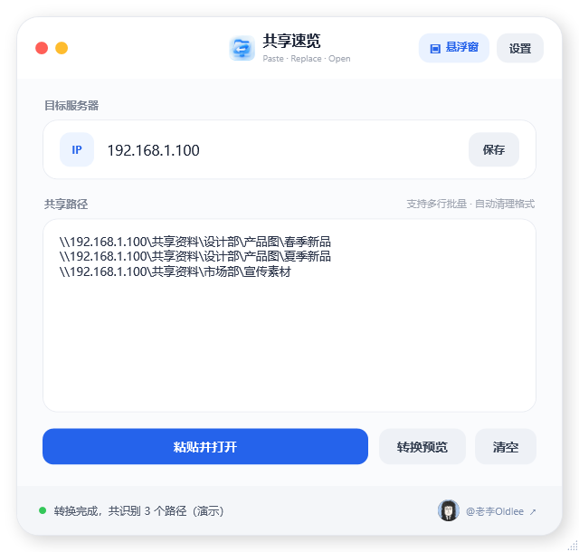
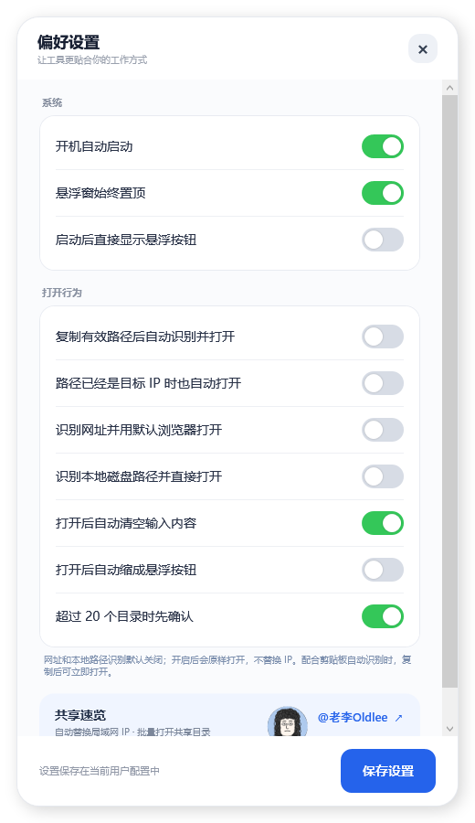

<p align="center">
  
</p>

<h1 align="center">共享速览</h1>

<p align="center">
  自动识别、替换并批量打开 Windows 局域网共享路径<br>
  也可选择识别网址和本地磁盘路径，原样交给系统打开
</p>

<p align="center">
  <a href="https://github.com/Oldleeo/SharedQuickView/releases/latest"></a>
  
  
  <a href="LICENSE"></a>
</p>

<p align="center">
  <a href="https://github.com/Oldleeo/SharedQuickView/releases/latest"><strong>下载最新版安装程序</strong></a>
  ·
  <a href="#三分钟上手">三分钟上手</a>
  ·
  <a href="#所有设置说明">所有设置</a>
  ·
  <a href="#隐私与安全">隐私与安全</a>
</p>


## 它解决什么问题

办公室里的共享文件夹经常会因为服务器迁移、不同网络或不同电脑使用不同 IP。别人发来的路径可以访问同一份资料，但服务器地址与你当前要用的地址不一致。

例如，复制到的是：

```text
\\192.168.1.20\共享资料\设计部\产品图\春季新品
```

目标服务器设置为 `192.168.1.100` 后，共享速览会自动转换为：

```text
\\192.168.1.100\共享资料\设计部\产品图\春季新品
```

随后直接进入“春季新品”文件夹，而不是只打开它的父目录。

> README 中的 IP 和目录都是演示数据，不对应任何真实服务器。

## 核心功能

| 功能 | 作用 |
|---|---|
| 自动替换服务器 IP | 只替换 UNC 路径中的服务器地址，其余共享名和子目录保持不变 |
| 批量打开 | 一次粘贴多条路径，自动识别数量并逐个打开 |
| 直接进入末级目录 | 完整路径指向哪个文件夹，就进入哪个文件夹 |
| 智能格式清理 | 兼容多余反斜杠、正斜杠、引号、网页空白编码和混合文本 |
| 转换预览 | 先查看替换结果，不立即打开资源管理器 |
| 剪贴板自动识别 | 可选：复制有效路径后无需按 `Ctrl + V`，自动转换并打开 |
| 同 IP 控制 | 可选择目标 IP 已相同时是否仍由自动模式打开 |
| 网址识别 | 可选且默认关闭；原样保留 `http/https` 网址并用默认浏览器打开 |
| 本地路径识别 | 可选且默认关闭；原样打开 `C:\`、`D:\` 等本地文件或文件夹 |
| 桌面悬浮窗 | 缩成简洁按钮，单击读取剪贴板，双击三点恢复主窗口 |
| 系统托盘 | 隐藏主窗口后仍可快速粘贴、显示窗口或退出 |
| 开机启动 | 安装时和软件设置中都可以控制 |
| 正规安装与卸载 | 支持安装目录、桌面快捷方式、开始菜单、隐私确认和系统卸载登记 |
| 本地运行 | 不上传目标 IP、共享路径或剪贴板内容，不含遥测和广告 |

## 三分钟上手

### 1. 安装

1. 从 [Releases](https://github.com/Oldleeo/SharedQuickView/releases/latest) 下载名称以 `SharedQuickView-Setup-` 开头的 Windows x64 安装程序。
2. 双击运行安装程序。
3. 默认安装目录为 `C:\Program Files\共享速览`，也可以点击“浏览”选择其他目录。
4. 按需要选择：
   - 创建桌面快捷方式；
   - 添加到开始菜单；
   - 开机自动启动。
5. 阅读《用户协议》和《隐私政策》，勾选同意后安装。







> 当前公开构建未购买商业代码签名证书。Windows 可能显示 SmartScreen 或“未知发布者”提示。请只从本仓库 Releases 下载，核对发布页 SHA-256；也可以按照下方步骤自行编译源码。不要为了安装本软件而永久关闭 Windows 安全功能。

### 2. 设置目标服务器

1. 打开共享速览。
2. 在“目标服务器”中填写你当前要访问的 IPv4 地址，例如 `192.168.1.100`。
3. 点击“保存”。

目标 IP 会保存在当前 Windows 用户的本地设置中，下次启动会自动恢复。

### 3. 粘贴并打开一条路径

复制任意 UNC 共享路径，然后：

- 点击中间输入框，按 `Ctrl + V`；或
- 点击“粘贴并打开”。

软件会自动识别路径、替换服务器地址，并让 Windows 资源管理器进入完整目录。

### 4. 一次打开多个路径

可以把多条路径一起复制，一行一条；中间有空行或网页粘贴产生的杂字符也可以。


点击“粘贴并打开”后，识别出的目录会依次打开。如果一次超过 20 个目录，默认会先询问，防止误开大量窗口。

### 5. 只转换，不打开

如果想先检查结果：

1. 把路径粘贴到输入框；
2. 点击“转换预览”；
3. 检查 IP 和完整目录是否正确；
4. 确认后再点击“粘贴并打开”。



## 支持识别的路径格式

以下内容都能自动清理并识别：

```text
\\192.168.1.20\共享资料\设计部\产品图
\\\192.168.1.20\共享资料\设计部\产品图
//192.168.1.20/共享资料/设计部/产品图
“\\192.168.1.20\共享资料\设计部\产品图”
路径：\\192.168.1.20\共享资料\设计部\产品图
```

在设置中开启对应选项后，还可识别：

```text
https://example.com/products/123
D:\设计资料\彩片\MO-16
```

网址和本地磁盘路径不会替换 IP，会原样交给默认浏览器或 Windows Shell 打开。

软件还会处理：

- 多行和空行；
- 中文或英文引号；
- 网页复制产生的 `&#x20;`；
- 斜杠 `/` 与反斜杠 `\`；
- 替换后完全相同的重复路径。

带协议的网址永远不会被当成 UNC 路径，因此网址中的 IP 不会被替换。两个扩展识别选项关闭时，网址和本地路径不会触发打开。

## 主界面所有按钮

| 控件 | 操作 |
|---|---|
| 左上红色按钮 | 隐藏到系统托盘，软件继续运行 |
| 左上黄色按钮 | 最小化窗口 |
| 目标服务器输入框 | 设置要替换成的 IPv4 地址 |
| 保存 | 保存目标 IP |
| 共享路径输入框 | 显示粘贴内容；支持多行和横向滚动 |
| 粘贴并打开 | 读取系统剪贴板、转换并打开全部有效路径 |
| 转换预览 | 只显示转换结果，不打开文件夹 |
| 清空 | 清空路径输入框 |
| 悬浮窗 | 把主界面缩成桌面悬浮按钮 |
| 设置 | 打开全部偏好设置 |
| 右下角 `@老李Oldlee` | 打开作者主页 |

## 悬浮窗怎么用


- 单击“粘贴并打开”：读取剪贴板并打开路径。
- 双击右侧三点：恢复完整主窗口。
- 拖动空白位置：移动悬浮窗。
- 右键：显示“粘贴并打开、展开主窗口、设置、退出”菜单。
- 按 `Esc`：恢复主窗口。
- 悬浮状态按 `Ctrl + V`：读取剪贴板并打开。

## 所有设置说明



### 系统

#### 开机自动启动

登录 Windows 后自动运行共享速览。关闭后会移除当前用户的启动项。

#### 悬浮窗始终置顶

让共享速览保持在其他普通窗口上方。适合需要频繁复制路径的工作场景。

#### 启动后直接显示悬浮按钮

软件启动后不显示完整主界面，直接进入悬浮状态。

### 打开行为

#### 复制有效路径后自动识别并打开

开启后，软件监听剪贴板变化。复制到符合要求的 UNC 路径时，会立即替换 IP 并打开，无需再按 `Ctrl + V`。如果另外开启网址或本地路径识别，这两类内容也会在复制后自动打开。

- 默认关闭，避免复制聊天记录或文档时误触发。
- 只处理新复制的文字。
- 网址和本地路径只有在各自选项开启后才会执行打开。

#### 路径已经是目标 IP 时也自动打开

这是“剪贴板自动识别”的附属开关：

- 关闭：路径服务器已经等于目标 IP 时，自动模式不重复打开；
- 开启：只要复制到有效路径，即使 IP 无需替换也会自动打开。

手动点击“粘贴并打开”不受此项限制。

#### 识别网址并用默认浏览器打开

- 默认关闭；
- 支持 `http://` 和 `https://`；
- 不会替换网址中的 IP 或其他内容；
- 开启剪贴板自动识别后，复制网址就会直接用默认浏览器打开。

#### 识别本地磁盘路径并直接打开

- 默认关闭；
- 支持 `C:\...`、`D:\...` 等完整盘符路径；
- 不会替换 IP，不会修改路径；
- 可打开文件夹，也可使用 Windows 中该文件类型的默认应用打开文件。

#### 打开后自动清空输入内容

成功发送打开请求后，清空输入框，适合连续处理不同路径。

#### 打开后自动缩成悬浮按钮

发送打开请求后自动收起主窗口，减少桌面遮挡。

#### 超过 20 个目录时先确认

批量识别超过 20 个目录时弹出确认框，避免一次误开大量资源管理器窗口。建议保持开启。

## 系统托盘

点击左上红色按钮后，共享速览会隐藏到任务栏通知区域。托盘菜单包含：

- 显示主窗口；
- 读取剪贴板并打开；
- 退出。

双击托盘图标可直接恢复主窗口。只有点击“退出”才会完全结束后台运行。

## 卸载

可以从以下任一位置开始卸载：

- Windows 设置 → 应用 → 已安装的应用 → 共享速览；
- 开始菜单 → 共享速览 → 卸载共享速览；
- 安装目录中的 `卸载共享速览.exe`。

卸载器会自动关闭正在运行的主程序。可以选择是否同时删除目标 IP、窗口位置和剪贴板偏好。


卸载程序本身正在运行时无法立即删除自己，因此会使用 Windows 官方延迟删除机制，在下次重启时清理最后一个卸载文件和空目录。它不会复制或运行临时卸载 EXE。

## 隐私与安全

共享速览是本地桌面工具：

- 不上传目标 IP；
- 不上传共享路径；
- 不上传剪贴板内容；
- 不包含账号系统、广告、统计 SDK 或遥测；
- 不扫描共享目录内容；
- 不删除或修改共享目录里的文件；
- 仅在用户点击作者链接时打开 `https://x.com/oldleeoo`。

个人设置保存在：

```text
%AppData%\Oldlee\共享速览\settings.json
```

详细说明见 [PRIVACY.md](PRIVACY.md)。发现安全问题请阅读 [SECURITY.md](SECURITY.md)，不要在公开 Issue 中提交真实 IP、共享路径、账号或内部目录截图。

## 从源码构建

### 环境要求

- Windows 10/11 x64；
- [.NET 8 SDK](https://dotnet.microsoft.com/download/dotnet/8.0)；
- PowerShell 7 或 Windows PowerShell 5.1。

### 一键构建

在仓库根目录执行：

```powershell
.\build.ps1
```

脚本会依次：

1. 运行路径解析测试；
2. 发布自包含单文件主程序；
3. 把主程序嵌入安装器；
4. 输出最终安装包。

生成文件：

```text
artifacts\app\共享速览.exe
artifacts\installer\共享速览安装程序.exe
```

也可以只运行测试：

```powershell
dotnet run --project .\tests\SharedQuickView.Tests\SharedQuickView.Tests.csproj -c Release
```

## 项目结构

```text
SharedQuickView/
├─ src/
│  ├─ SharedQuickView/              # WPF 主程序
│  └─ SharedQuickView.Installer/    # 安装与卸载程序
├─ tests/SharedQuickView.Tests/      # 路径解析回归测试
├─ docs/images/                      # 脱敏教程截图
├─ build.ps1                         # 一键构建脚本
├─ PRIVACY.md                        # 隐私说明
├─ SECURITY.md                       # 安全报告说明
└─ LICENSE                           # MIT License
```

## 常见问题

### 为什么输入三条路径只打开两条？

如果替换目标 IP 后两条路径完全相同，软件会自动去重。也请检查共享名和最后一级目录是否完整。

### 为什么资源管理器没有打开？

请依次检查：

1. 目标 IP 是否填写正确；
2. 当前电脑是否能访问目标服务器；
3. Windows 是否已经保存共享账号凭据；
4. SMB 服务和 445 端口是否可用；
5. 当前账号是否有该目录权限。

### 为什么打开了父目录？

2.0.2 起已改为直接打开完整 UNC 目录。请确认使用的是最新版，并检查路径末尾是否在复制时被截断。

### 为什么复制网址后没有打开？

“识别网址并用默认浏览器打开”默认关闭。需要自动打开时，请同时开启它和“复制有效路径后自动识别并打开”。即使不开启，网址也不会再被当成共享路径替换 IP。

### 为什么复制后没有自动打开？

“复制有效路径后自动识别并打开”默认关闭，请在设置中手动开启。如果路径已经是目标 IP，还需要检查“路径已经是目标 IP 时也自动打开”。

### 为什么 Windows 提示未知发布者？

开源项目当前没有商业代码签名证书。请从官方仓库下载并核对 SHA-256，或自行编译源码。不要下载第三方改包。

## 开源许可与作者

共享速览由 [老李Oldlee](https://x.com/oldleeoo) 制作并无偿开源。

本项目采用 [MIT License](LICENSE)：允许免费使用、复制、修改、分发和商用，但必须保留许可证和版权声明。

如果这个小工具帮你节省了时间，欢迎 Star、提交 Issue 或改进代码。
